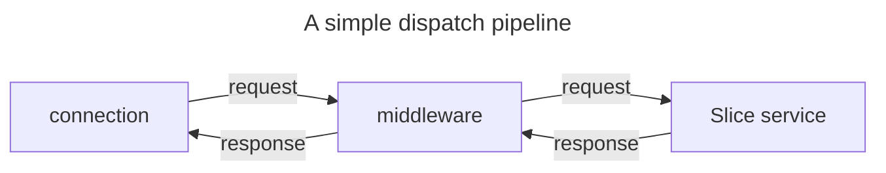

# 管道调度

> 了解如何接受请求并返回响应。

## 定义

接受/完成请求并返回响应的过程称为**调度**。

调度通常由服务器连接创建: 服务器连接接收请求,发送该请求,然后发送回发送提供的响应。

然而,由于客户端和服务器`连接`具有相同的功能,因此客户端连接也可以调度请求。

## 调度`Dispatcher`抽象

当连接接收到请求时,它会使用其配置的调度程序调度此请求。该调度程序是接受传入请求并返回传出响应的抽象。它是调用者`invoker`抽象服务器端的对应部分。
  
`Invoker` 和 `Dispatcher` 之间的一个重要区别，是需要实现此 `Dispatcher` 抽象来满足请求并生成响应。`Invoker` 抽象由 `IceRPC` 的连接实现。

C# 中, 这个调度器抽象是 `IDispatcher` 接口:

```csharp
namespace IceRpc;

public interface IDispatcher
{
    ValueTask<OutgoingResponse> DispatchAsync(
        IncomingRequest request,
        CancellationToken cancellationToken = default);
}
```

 当构建接受此连接的服务器时,会配置服务器连接的调度程序。该调度程序不能为空。服务器与其接受的所有连接共享其调度程序。例如:

```csharp
// configures server to use a new Chatbot instance as its dispatcher
await using var server = new Server(new Chatbot());
```

为客户端连接配置调度程序是可选的,因为客户端连接不必接受请求。

C# 中,将客户端连接的调度程序配置为 `ConnectionOptions` 类。例如:

```csharp
using IceRpc;

// ClientConnectionOptions derives from ConnectionOptions
var clientConnectionOptions = new ClientConnectionOptions
{
    Dispatcher = new MyCallback(),
    ServerAddress = new Uri("icerpc://hello.zeroc.com")
};

await using var connection = new ClientConnection(clientConnectionOptions);
```

## 处理调度`Dispatcher`

调度抽象提供了很大的灵活性。一个 `Slice` 服务是调度程序,因此很容易配置服务器，将其收到的所有请求，调度到同一个 `Slice` 服务。

调度器，实现可以调度到，另一个调度器,该调度器本身，调度到另一个调度器,等等;

在服务器上配置的调度程序可以是调度程序链或树的头部,称为"调度管道"`dispatch pipeline`.

3种常见的调度类型:

- **Leaf dispatcher**\
  这是调度管道中的子叶。例如,Slice 服务。

- **Middleware**\
   中间件拦截调度并将其转发到"下一个"调度程序。IceRPC提供了几个内置的中间件,用于日志记录,压缩等。

- **Router**\
   路由器根据请求的路径，将请求路由到，在该路由器注册的调度员。它还可以托管多一个中间件。



[connections]: ../connection/how-to-create-a-connection
[invoker]: ../invocation/invocation-pipeline#the-invoker-abstraction
[Slice service]: /slice/language-guide/interface

[IDispatcher]: csharp:IceRpc.IDispatcher
[ConnectionOptions]: csharp:IceRpc.ConnectionOptions
