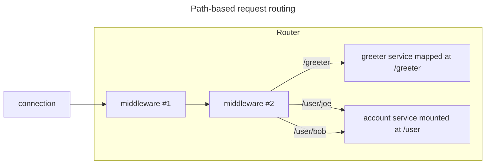
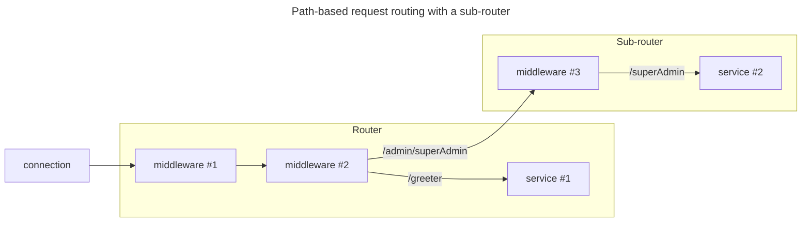

# 路由 `Router`

> 了解如何根据路径路由传入的请求。

## 基于路径的路由

路由是根据请求的路径，将传入的请求，路由到其他调度器的调度器。它还可以沿着这条路线执行中间件。



这些其他调度程序使用`map`和`mount`方法在路由器上注册。

- `map` 将调度程序与路由器中的路径相关联。

    例如,可以将路径`/greeter`映射到`chatbot`服务，这是一场完全匹配的。具有路径`/greeter2` 或 `/greeter/foo` 的请求是不匹配。

   C#中,会像如下代码一样:

    ```csharp
    var router = new Router();
    router.Map("/greeter", chatbot);
    ```

- `mount` 将调度程序与路由器中的路径前缀相关联。

    例如,您可以将路径前缀`/user`挂载到`account服务`。具有路径`/user`或
    `/user/foo` 的请求是匹配的。而具有路径 `/`, `/user2`的请求是不匹配。
  
     C#中, 代码如下:

    ```csharp
    var router = new Router();
    router.Mount("/user", account);
    ```

映射子叶调度程序（例如服务和安装子路由器）很常见,但这并不是一个硬性规则。

以映射并安装完全相同的路径（例如`/greeter`）。路由器将带有路径`/greeter`的请求，引导到映射的调度器,并将带有路径`/greeter/foo`的请求，引导到安装的调度器。

如果路由器没有找到，传入请求路径的映射或安装调度程序,则它会返回具有状态代码 `NotFound` 的响应。

## 子路由

子路由器是在另一个"父"路由器注册的路由器。它有一个与其安装点相对应的前缀;当它查找通过`map` 或 `mount`注册的调度员时,它会删除该前缀。



C# 中, 可以创建一个子路由, 并使用 `Route` 扩展方法单步安装:

```csharp
var router = new Router();

// create a sub-router and mount it at /admin
router.Route("/admin", subRouter => subRouter.UseDispatchInformation().Map("/superAdmin", root));
```

此示例的根服务的完整路径是`/admin/superAdmin`。管理子路由器在尝试将此路径与其映射和挂载字典中的条目匹配之前,会从请求的路径中删除`/admin`。

## 在路由中安装中间件

路由可以在将请求，移交给映射或安装的调度程序之前执行一个或多个中间件。

在 C# 中,这些中间件通过类路由上的 `Use{Name}`  扩展方法注册。例如:

```csharp
Router router = new Router().UseLogger(loggerFactory).UseCompressor();
router.Map("/greeter", new Chatbot());
```

安装这些中间件的顺序通常很重要。安装的第一个中间件，是第一个要执行的中间件。通过上面的示例,记录器中间件首先执行,然后在压缩器中间件上调用 `DispatchAsync`,最后压缩器中间件在`/greeter` 映射的 `Chatbot` 服务上调用 `DispatchAsync`。 

>路由总是将传入的请求发送到其注册的中间件,即使它最终返回带有状态代码 `NotFound` 的响应。

[Router]: csharp:IceRpc.Router
