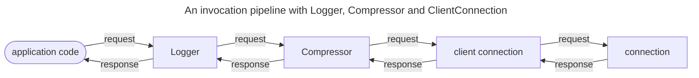

# 拦截器 Interceptor

> 了解如何编写拦截器以及如何在调用管道中安装拦截器。

## 拦截传出的请求

拦截器是在通过网络连接发送传出请求之前拦截传出请求的代码。 相同的代码还会在远程服务到达调用者之前拦截它返回的传入响应。

在技术层面上，拦截器是持有另一个调用器(`next`)并在下一个调用器上调用，调用的调用器`invoke`，作为其自己的调用方法实现的一部分。
  下一个调用器可以是客户端连接、连接缓存、另一个拦截器或其他类型的调用器；就拦截器而言，它只是另一个调用器。

拦截器可以在调用下一个调用器调用调用之前（在发送请求之前）和调用下一个调用器调用调用之后（在收到响应之后）包含逻辑。 拦截器还可以使调用管道短路，返回缓存响应或抛出异常。

例如,一个简单的 C# 拦截器可能如下所示:

```csharp
public class SimpleInterceptor : IInvoker
{
    private readonly IInvoker _next;

    public SimpleInterceptor(IInvoker next) => _next = next;

    public async Task<IncomingResponse> InvokeAsync(OutgoingRequest request, CancellationToken cancellationToken)
    {
        Console.WriteLine("before _next.InvokeAsync");
        IncomingResponse response = await _next.InvokeAsync(request, cancellationToken);
        Console.WriteLine($"after _next.InvokerAsync; the response status code is {response.StatusCode}");
        return response;
    }
}
```

## 安装拦截器

C# 中,您可以通过创建类 `Pipeline` 的实例,然后调用 `Use{Name}` 扩展方法来创建调用管道,以便在此管道上安装拦截器。

例如:

```csharp
Pipeline pipeline = new Pipeline()
    .UseLogger(loggerFactory)
    .UseCompressor()
    .Into(clientConnection);
```

需要使用 `Into` 指定管道的最后一个调用器。 它通常是客户端连接或连接缓存,但它也可以是另一个管道,因为 `Pipeline` 本身就是调用器。
当在管道上进行调用时,请求会经过该调用器链。在返回的途中,传入的响应以相反的顺序穿过同一条调用者链。



安装这些拦截器的顺序很重要。 安装的第一个拦截器是第一个执行的拦截器。通过上面创建的管道，日志拦截器首先执行,然后在压缩拦截器上调用 `InvokeAsync`，最后压缩拦截器在客户端连接上调用 `InvokeAsync`。

[Pipeline]: csharp:IceRpc.Pipeline
