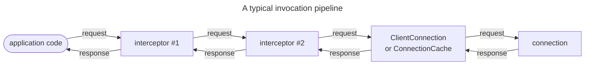

# 调用管道 `Invocation pipeline`

> 了解如何发送请求`requests`和接收响应`responses`。

## 定义

发送请求并接收相应响应的过程称为调用。

通常会通过客户端连接进行调用。然而,由于客户端和服务器连接具有相同的功能,因此也可以反过来调用,从连接的服务器端到此连接的客户端。

## 调用抽象

IceRPC总是通过调用调用器`invoker`来进行调用。调用器是一个简单的抽象,它接受传出的请求并返回传入的响应。

C# 中, 这个抽象是 `IInvoker` 接口:

```csharp
namespace IceRpc;

public interface IInvoker
{
    Task<IncomingResponse> InvokeAsync(OutgoingRequest request, CancellationToken cancellationToken = default);
}
```

`ClientConnection` 和 `ConnectionCache` 都实现此接口。 这允许通过创建客户端连接或连接缓存,然后在生成的实例上调用 InvokeAsync 来进行调用:

```csharp
await using var clientConnection = new ClientConnection(new Uri("icerpc://hello.zeroc.com"));
using var request = new OutgoingRequest(...);

// Make an invocation by calling the IInvoker.InvokeAsync method implemented by ClientConnection.
IncomingResponse response = await clientConnection.InvokeAsync(request);
```

## 处理调用

在将其提供给连接之前,通常会对调用执行附加处理。例如,可能需要压缩请求的有效负载、为每个请求添加遥测字段、添加截止时间或简单地添加日志记录等。

调用器实现可以调用另一个调用器,它本身调用另一个调用器,等等;用于进行调用的调用器可以是调用器链或树的头,称为"调用管道"`invocation pipeline`.

3种常见的调用者类型:

- **Leaf invoker**\
   这是调用管道中的一片叶子。该调用器通常是连接。

- **Interceptor**\
    拦截器拦截调用，并将其转发到"下一个"`next`拦截器。IceRPC提供了几个内置的拦截器,用于记录,压缩等。

- **Pipeline**\
    管道在向调用器发出请求之前,通过在该管道中注册的拦截器来执行请求。



[connections]: ../connection/how-to-create-a-connection

[ClientConnection]: csharp:IceRpc.ClientConnection
[ConnectionCache]: csharp:IceRpc.ConnectionCache
[InvokeAsync]: csharp:IceRpc.IInvoker#IceRpc_IInvoker_InvokeAsync_IceRpc_OutgoingRequest_System_Threading_CancellationToken_
[IInvoker]: csharp:IceRpc.IInvoker


