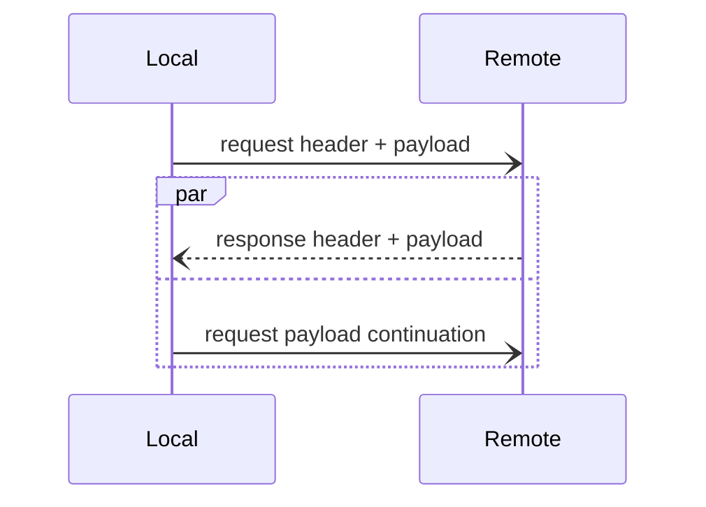

# 传出请求 `Outgoing request`

> 了解如何创建传出请求

## Creating an outgoing request

为了创建 RPC,构造一个传出请求,然后将此请求作为参数传递给调用者`invoke`的调用方法。

传出请求携带调用者发送请求所需的所有信息:

- 目标服务的服务地址`service address`
- 调用此服务的操作名称
- 请求字段
- 请求的有效负载

传出请求还包含功能`features`。这些功能用于该管道内的本地通信；它们还用于管道中的调用者和应用程序代码之间的通信。

## 请求字段

请求字段表示由"传输连接"的请求承载的带外信息". 这些字段通常由拦截器和中间件读取和写入,以协调客户端和服务器中相同请求的处理。

字段是字节序列的字典 `RequestFieldKey` 中的条目,其中 `RequestFieldKey` 是 `Slice` 中定义的枚举:

```slice
unchecked enum RequestFieldKey : varuint62 {
    Context = 0
    TraceContext = 1
    CompressionFormat = 2
    Deadline = 3
    Idempotent = 4
}
```

例如,当压缩拦截器压缩传出请求的有效负载时,它设置请求字段`CompressionFormat`。这告诉连接另一侧的压缩中间件"该有效负载是用 `brotli` 压缩的";然后压缩中间件可以解压缩该（传入）请求有效负载。

## 请求有效负载和继续有效负载

请求的有效负载是表示操作参数的字节流。 当连接发送请求时,它会读取这些字节并将其逻辑复制到网络连接,直到不再有字节需要读取。

另一方面,连接从网络读取这些字节,创建传入请求并将此请求提供给调度器 `dispatcher`。

传出请求的有效负载实际上分为两部分:连接在等待响应之前发送的第一部分,以及连接在等待、接收和返回响应时在后台发送的第二部分("继续")。



另一方面,调度器仅看到单个连续的传入请求有效负载。

## 请求功能

调用管道中的调用者在调用期间相互传输信息是很常见的。 例如,重试拦截器需要与连接缓存通信,以确保连接缓存不会继续使用相同的服务器地址重试。C# 中,这些调用者获取并设置请求的 `IFeatureCollection` 以相互通信。

还可以使用这些功能与调用管道进行通信。例如,您可以设置功能 `ICompressFeature` 以要求压缩机拦截器（如果已安装）压缩请求的有效负载:

```csharp
using var request = new OutgoingRequest(serviceAddress)
{
    Payload = largePayload,
    Features = new FeatureCollection().With<ICompressFeature>(CompressFeature.Compress)
};

// Hopefully invoker is an invocation pipeline with a compressor interceptor.
IncomingResponse response = await invoker.InvokeAsync(request);
```

按照惯例,这些功能是使用接口类型进行管控的,例如上面示例中的 `ICompressFeature`。

> 字段用于"传输连接"进行通信,而特征用于调用管道内的本地通信。`IceRPC`同时提供请求字段（由请求承载）和响应字段（由响应承载）,但只提供请求特性:由于它都是本地的,因此不需要响应特性。

[middleware]: ../dispatch/middleware
[dispatcher]: ../dispatch/dispatch-pipeline#the-dispatcher-abstraction

[RequestFieldKey]: https://github.com/icerpc/icerpc-slice/blob/main/IceRpc/RequestFieldKey.slice
[CompressionFormat]: https://github.com/icerpc/icerpc-slice/blob/main/IceRpc/CompressionFormat.slice

[IFeatureCollection]: csharp:IceRpc.Features.FeatureCollection
[ICompressFeature]: csharp:IceRpc.Features.ICompressFeature
