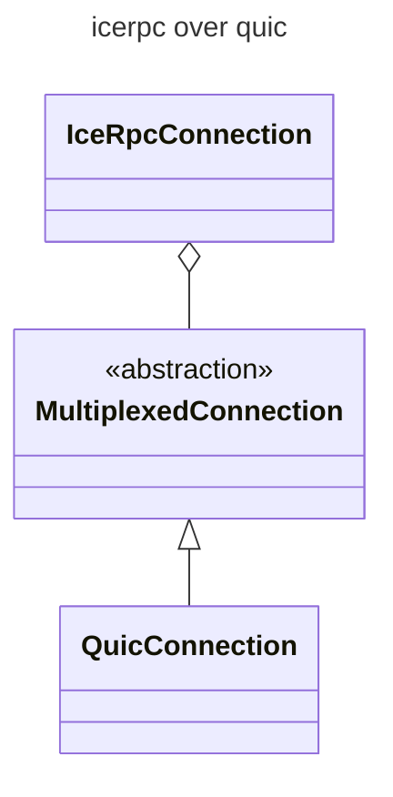
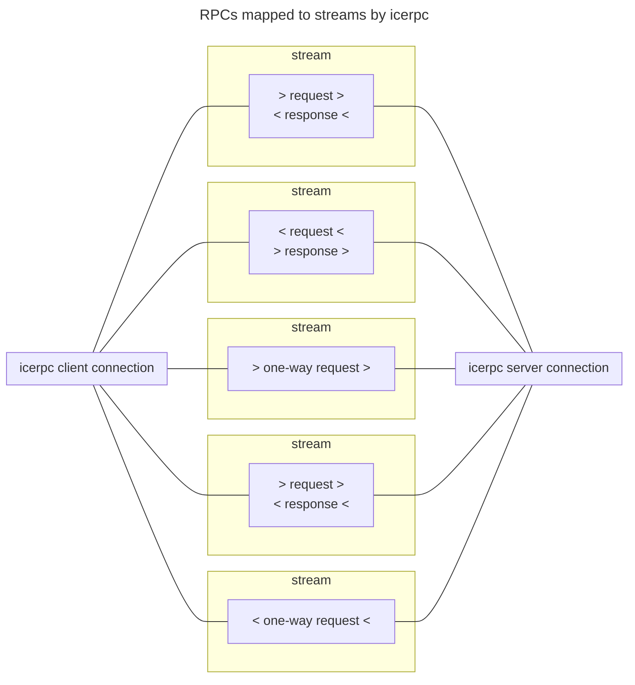
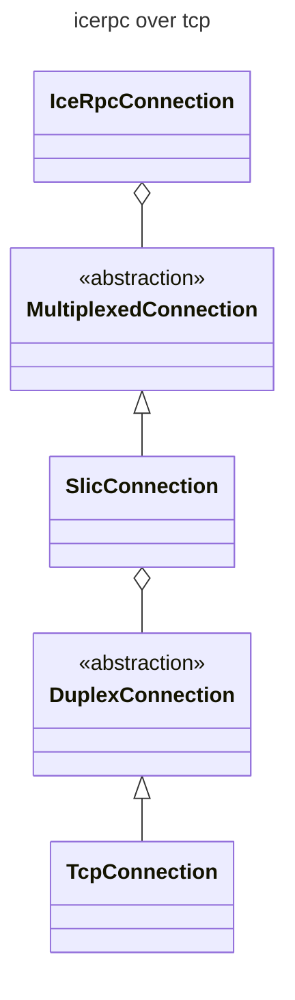

# icerpc 和多路复用传输

> 了解 icerpc 协议和多路复用传输

## icerpc 协议

当创建到服务器地址 `icerpc://hello.zeroc.com` 的客户端连接时,指示 IceRPC 建立使用 icerpc 协议的连接。

icerpc 是一种应用层协议,通过多路复用连接传输 RPC（请求和响应）。

> 在讨论 icerpc 协议时,我们总是用小写拼写 icerpc。这避免了与 IceRPC 框架的混淆

## 多路复用传输

路复用传输页面，描述了在连接内提供独立流的现代传输的抽象。比如，典型的多路复用传输是[QUIC] 。

icerpc 连接在由多路复用传输，创建的多路复用连接，上运行。



icerpc 协议通过为每个请求 + 响应对创建专用双向流,通过多路复用连接发送请求和响应。它为每个单向请求创建单向流,因为单向请求没有响应。



由于每个流都是独立的,因此不存在[队头阻塞]。 可以通过同一连接发送大小请求和响应的组合:大请求和响应不会阻止，或延迟小请求和响应。

## IceRPC 的首选协议

icerpc 自然是 IceRPC 的首选协议。

icerpc 提供了 IceRPC API 和功能的最直接实现。 特别是,IceRPC 的请求字段、响应字段和状态码按原样由 icerpc 传输。它还支持有效负载连续性。

## icerpc 通过双工连接

目前只有一种标准复用传输:QUIC。 由于 QUIC 是新的且不普遍可用,因此可能需要将 icerpc 与传统的双工传输（例如 TCP）一起使用。

解决方案是 IceRPC 的 Slic 传输层。Slic 在双工传输抽象上实现复用传输抽象。



C# 中,默认的多路复用传输是 TCP 上的 Slic,称为 `tcp`。以下语句都创建等效的 icerpc 连接。

```csharp
// Create a client connection with the default multiplexed client transport, Slic over TCP.
using await var clientConnection = new ClientConnection("icerpc://hello.zeroc.com");

// Make sure we use Slic over TCP (correct but redundant).
using await var clientConnection = new ClientConnection("icerpc://hello.zeroc.com?transport=tcp");

// Create a new multiplexed client transport with default options.
var clientTransport = new SlicClientTransport(new TcpClientTransport());
using await var clientConnection = new ClientConnection(
    "icerpc://hello.zeroc.com",
    multiplexedClientTransport: clientTransport);
```

[multiplexed-transport]: ../multiplexed-transport
[duplex-transport]: ../duplex-transport
[request-fields]: ../invocation/outgoing-request#request-fields
[response-fields]: ../invocation/incoming-response#response-fields
[status-code]: ../invocation/incoming-response#status-code
[payload-continuation]: ../invocation/outgoing-request#request-payload-and-payload-continuation

[application-layer]: https://en.wikipedia.org/wiki/Application_layer
[QUIC]: https://www.rfc-editor.org/rfc/rfc9000.html
[head-of-line-blocking]: https://en.wikipedia.org/wiki/Head-of-line_blocking
[队头阻塞]: https://baike.baidu.com/item/%E9%98%9F%E5%A4%B4%E9%98%BB%E5%A1%9E/22814180
